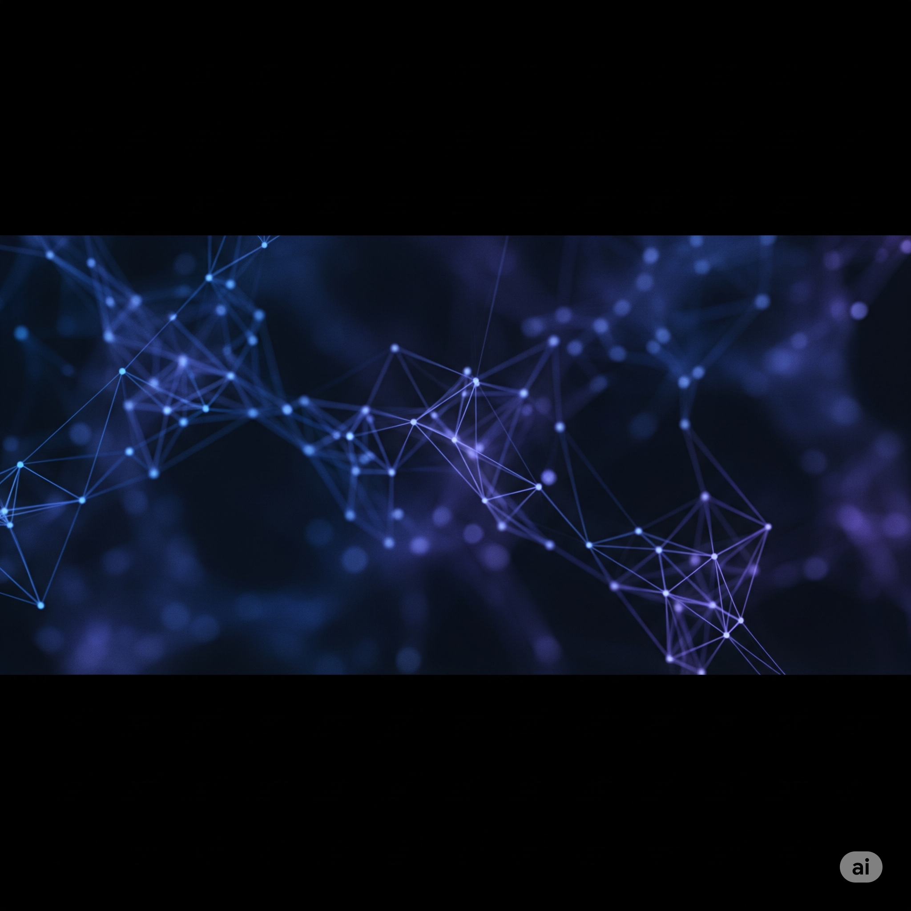
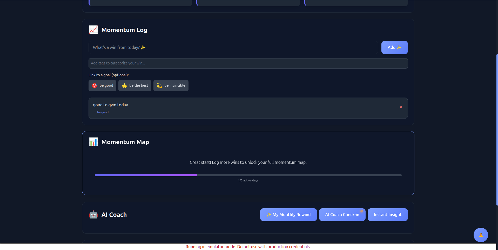

# MindShift ✦ from doomscroll to do-mode

Trade mindless scrolling for meaningful progress. A modern, Gen Z–friendly productivity app that turns tiny wins into daily momentum—with calm visuals, a strong “why,” and a little AI magic.

<p align="center">
  
  <br/>
  <sub>React + Vite · Firebase (Auth, Firestore, Functions) · Gemini AI</sub>
  <br/>
  <sub>Node 18</sub>
  <br/><br/>
  
  <br/>
  <em>Design-first, shame-free, momentum-focused.</em>
  <br/><br/>
  <a href="#demo">Skip to Demo ↓</a>
 </p>

## Table of contents

- About the project
- Mission statement
- Key features
- Demo and screenshots
- Tech stack
- Architecture (diagram)
- Repository structure (diagram)
- Quick start
- API + data model
- Configuration
- Docs hub
- Roadmap (future aspects)
- Contributing

---

## About the project

MindShift connects the dots between your daily actions and your deeper “why.” It’s a lightweight, opinionated companion for intentional days—fast, beautiful, and friendly.

Who it’s for:
- Students, makers, indie hackers, anyone seeking more intention
- People who want calm, fast tools without bloat or guilt

Design principles:
- Minimal core, maximal personality; dark-mode-first; tasteful motion
- Shame-free language; clarity over jargon; speed over ceremony

## Mission statement

Make intentional living effortless by turning attention into action and action into compounding momentum.

## Key features

- Attention Swap: a one-tap, pattern-interrupt overlay to reset focus
- Momentum Log: a shame-free done list with real-time updates
- Compass Goals: your top 3 goals, always visible and linkable
- AI Reflections: short, human-friendly summaries and weekly insights (Gemini)
- Optional Notion bridge: pull events, create simple tasks
- Tags + goal linking to surface patterns over time
- Dark-mode-first with curated accents and smooth micro-animations

## Demo and screenshots

<p id="demo">
  <a href="frontend/public/videos/mindshift-concept.mp4">
    
  </a>
  <br/>
  <sub>Click the image to watch a short concept demo.</sub>
</p>

Additional visuals:

<details>
<summary>Hero loop (inline video)</summary>

<video src="frontend/public/hero-loop.mp4" controls width="720">Your browser doesn’t support embedded videos. Watch the demo video above.</video>

</details>

<details>
<summary>Compass view (screenshot)</summary>



</details>

## Tech stack

- Frontend: React (Vite), Tailwind CSS, React Router
- Backend: Firebase (Auth, Firestore, Cloud Functions)
- AI: Gemini (Google Generative AI)
- Integration: Notion API (optional)

## Architecture (diagram)

```mermaid
flowchart LR
  subgraph Client
    A[MindShift UI (React + Vite, Tailwind)]
  end

  subgraph Firebase
    B[Auth]
    C[Firestore]
    D[Cloud Functions]
  end

  E[(Gemini AI)]
  F[(Notion API)]

  A <--> B
  A <--> C
  A -->|Callable| D
  D <--> C
  D --> E
  D --> F

  classDef svc fill:#111,border-color:#444,color:#eee
  class A,B,C,D,E,F svc
```

## Repository structure (diagram)

```mermaid
graph TD
  R[MindShift/] --> FE[frontend/]
  R --> BE[backend/]
  R --> DOCS[docs/]
  R --> FB[firebase.json + firestore.rules + indexes]

  FE --> FEsrc[src/]
  FEsrc --> FEcmp[components/]
  FEsrc --> FEpages[pages/]
  FEsrc --> FEctx[contexts/]
  FE --> FEpub[public/]

  BE --> BEsrc[src/]
  BE --> BEcfg[config(.example).js]

  DOCS --> Didx[README.md]
  DOCS --> Darch[ARCHITECTURE.md]
  DOCS --> Dapi[API_REFERENCE.md]
  DOCS --> Drun[README_RUN.md]
```

If you prefer the classic tree view:

```
frontend/ · backend/ · docs/ · firebase.json · firestore.rules · firestore.indexes.json
```

## Quick start

Prefer the full step-by-step? See GETTING_STARTED.md.

```bash
# From the repo root
npm --prefix frontend install
npm --prefix backend install

# Provide your Gemini key (choose one)
export GEMINI_API_KEY="your-gemini-key"
# or
firebase functions:config:set gemini.key="your-gemini-key"

# Start Firebase emulators (Auth, Firestore, Functions)
firebase emulators:start --only functions,firestore,auth

# In a new terminal: start the frontend
cd frontend
npm run dev
# Open the printed localhost URL (usually http://localhost:5173)
```

## API + data model

Cloud Functions (callable unless noted):
- generateMomentumSummary — summarize last 7 days via Gemini
- generateWeeklyReflection — longer weekly insights
- saveNotionConfig — save user’s Notion token and DB IDs
- fetchNotionEvents — read upcoming events from Notion
- createNotionTask — create a simple Notion task
- createUserProfile (auth trigger) — seed profile + default goals

Data model highlights:

```javascript
// /users/{uid}
{
  email: string,
  createdAt: Timestamp,
  compassGoals: { goal1: string, goal2: string, goal3: string }
}

// /users/{uid}/momentumLogs/{logId}
{
  text: string,
  createdAt: Timestamp,
  tags?: string[],
  linkedGoal?: 'goal1' | 'goal2' | 'goal3'
}
```

## Configuration

- Gemini key: `export GEMINI_API_KEY="<key>"` or `firebase functions:config:set gemini.key="<key>"`
- Frontend Firebase web config: `frontend/src/firebase.js`
- Optional: copy `backend/config.example.js` → `backend/config.js` for file-based dev keys (gitignored)

## Docs hub

All the details live in the docs folder:
- Start here: docs/README.md
- Architecture: docs/ARCHITECTURE.md
- API Reference: docs/API_REFERENCE.md
- Local run guide: docs/README_RUN.md and GETTING_STARTED.md
- Emulators: docs/EMULATORS.md
- Deployment: docs/DEPLOYMENT_GUIDE.md
- Troubleshooting: docs/TROUBLESHOOTING.md

## Roadmap (future aspects)

- Streak-aware reflections and context windows
- Focus modes with ambient scenes and haptics
- Deeper Notion sync (labels, two-way tasks)
- iOS/Android companion (React Native + Firebase)
- Rich insights: tag clusters, goal heatmaps, weekly digests

## Contributing

Issues and PRs welcome. If you add a new feature, include a quick usage note and emulator/test coverage where relevant. See docs/CONTRIBUTING.md and docs/STYLE_GUIDE.md.

—

Need a step-by-step local guide? See GETTING_STARTED.md. For a full index, start at docs/README.md.