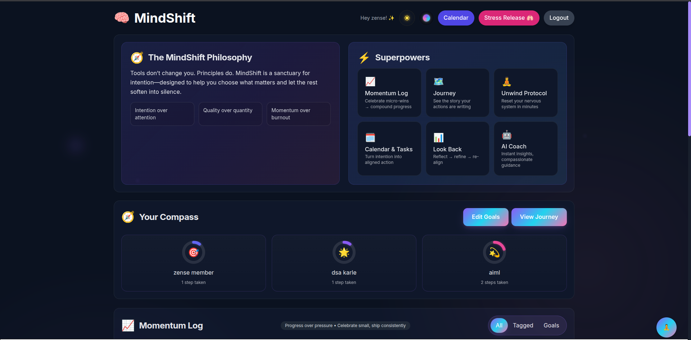
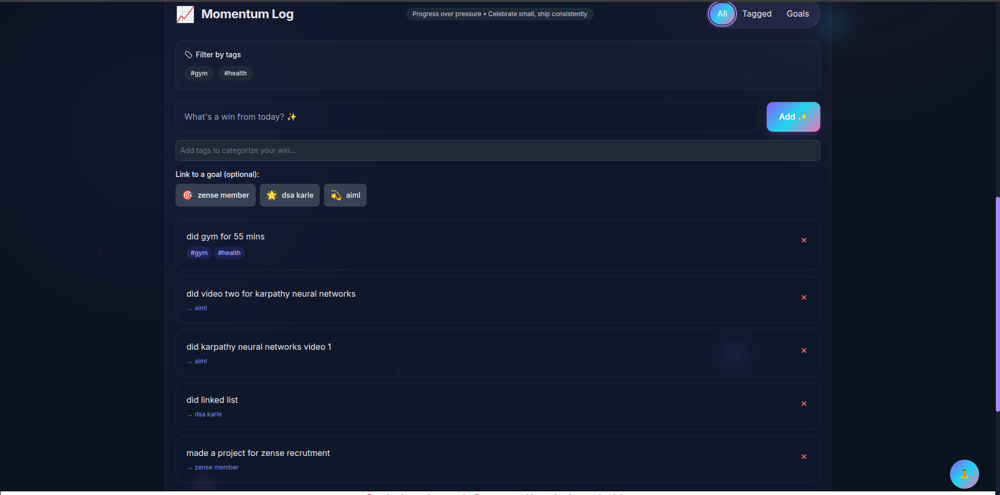
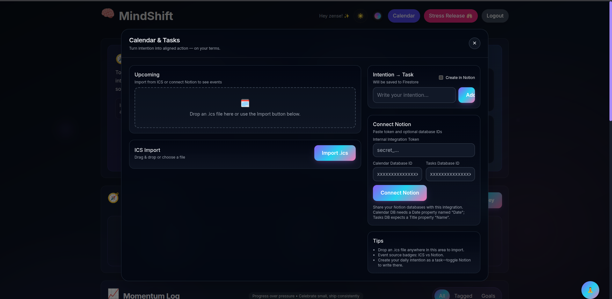
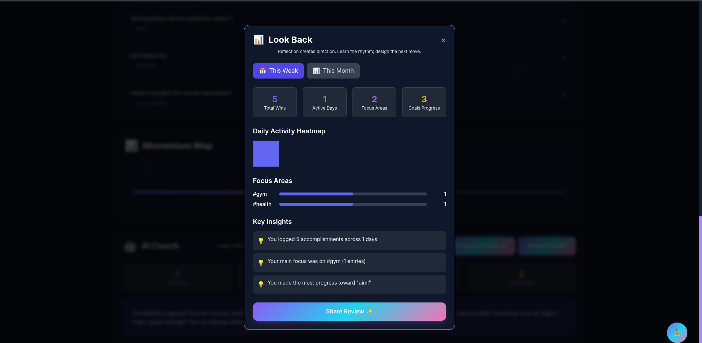
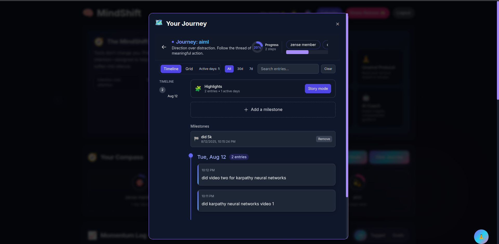
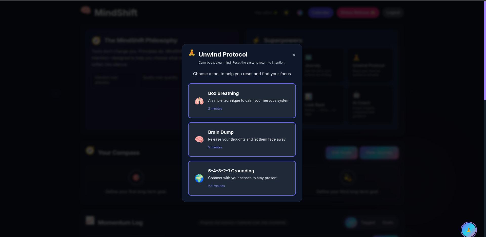
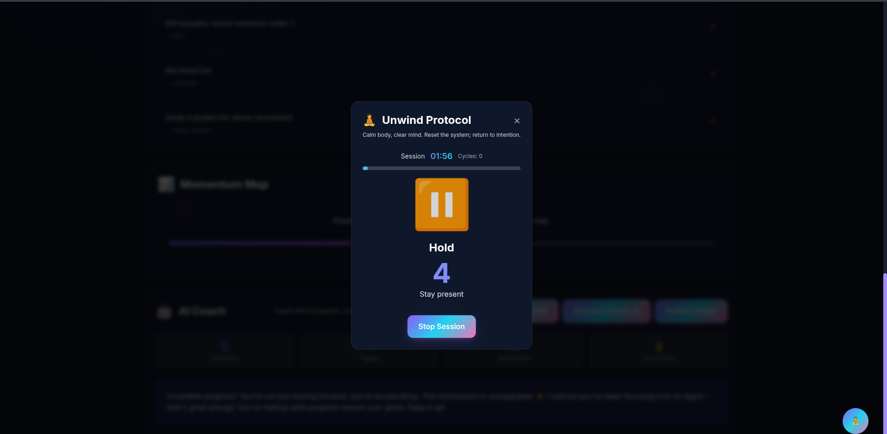
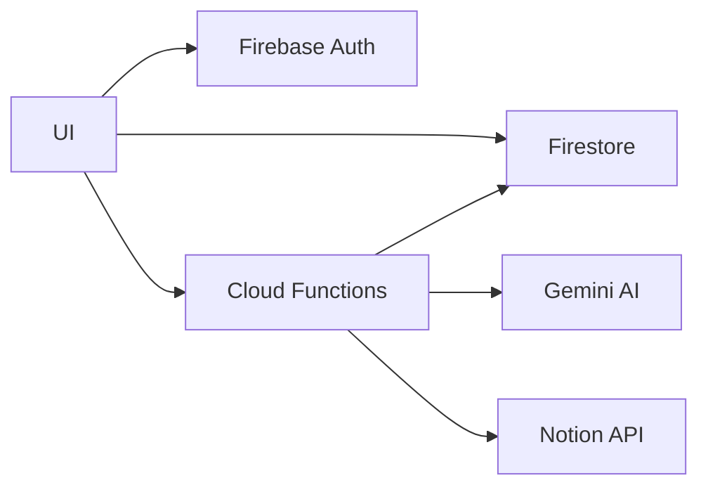
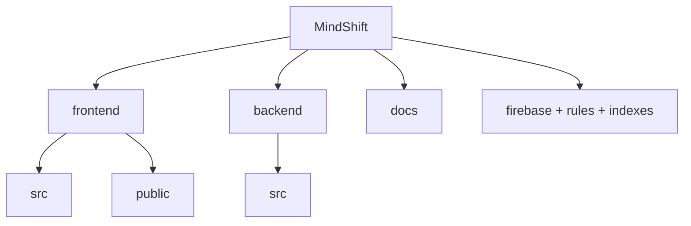

# MindShift ✦ from doomscroll to do-mode

Trade mindless scrolling for meaningful progress. A modern, Gen Z–friendly productivity app that turns tiny wins into daily momentum—with calm visuals, a strong “why,” and a little AI magic.

<p align="center">
  
  <br/>
  <sub>React + Vite · Firebase (Auth, Firestore, Functions) · Gemini AI</sub>
  <br/>
  <sub>Node 18</sub>
  <br/><br/>
  <br/>
  <em>Design-first, shame-free, momentum-focused.</em>
  <br/><br/>
 </p>

## Table of contents

- [About the project](#about-the-project)
- [Mission statement](#mission-statement)
- [Key features](#key-features)
- [Demo and screenshots](#demo-and-screenshots)
 - [Demo and screenshots](#demo-and-screenshots)
 
- [Tech stack](#tech-stack)
- [Architecture (diagram)](#architecture-diagram)
- [Repository structure (diagram)](#repository-structure-diagram)
- [Quick start](#quick-start)
- [API + data model](#api--data-model)
- [Configuration](#configuration)
- [Docs hub](#docs-hub)
- [Roadmap (future aspects)](#roadmap-future-aspects)
- [Contributing](#contributing)

---

## About the project

MindShift connects the dots between your daily actions and your deeper “why.” It’s a lightweight, opinionated companion for intentional days—fast, beautiful, and friendly.

Who it’s for:
- Students, makers, indie hackers, anyone seeking more intention
- People who want calm, fast tools without bloat or guilt

Design principles:
- Minimal core, maximal personality; dark-mode-first; tasteful motion
- Shame-free language; clarity over jargon; speed over ceremony

## Mission statement

Make intentional living effortless by turning attention into action and action into compounding momentum.

## Key features

- Attention Swap: a one-tap, pattern-interrupt overlay to reset focus
- Momentum Log: a shame-free done list with real-time updates
- Compass Goals: your top 3 goals, always visible and linkable
- AI Reflections: short, human-friendly summaries and weekly insights (Gemini)
- Optional Notion bridge: pull events, create simple tasks
- Tags + goal linking to surface patterns over time
- Dark-mode-first with curated accents and smooth micro-animations

## Demo and screenshots

<a id="demo"></a>

|  |  |
|---|---|
|  |  |
|  |  |
|  |  |
|  |  |

## Tech stack

- Frontend: React (Vite), Tailwind CSS, React Router
- Backend: Firebase (Auth, Firestore, Cloud Functions)
- AI: Gemini (Google Generative AI)
- Integration: Notion API (optional)

## Architecture (diagram)

Always-on ASCII diagram:

```
[Client] MindShift UI (React + Vite, Tailwind)
  |\
  | \-> Firebase Auth
  |----> Firestore (real-time reads/writes)
  \----> Cloud Functions (callable)

[Cloud Functions]
  <--> Firestore
   --> Gemini AI
   --> Notion API
```

Details (Mermaid, collapsible):

<details>
<summary>Mermaid (click to expand)</summary>



</details>

 

## Repository structure (diagram)

Always-on ASCII tree:

```
MindShift/
├─ frontend/
│  ├─ src/
│  │  ├─ components/
│  │  ├─ pages/
│  │  └─ contexts/
│  └─ public/
├─ backend/
│  ├─ src/
│  └─ config(.example).js
├─ docs/
│  ├─ README.md · ARCHITECTURE.md · API_REFERENCE.md · README_RUN.md
├─ firebase.json · firestore.rules · firestore.indexes.json
```

Details (Mermaid, collapsible):

<details>
<summary>Mermaid (click to expand)</summary>



</details>

## Quick start

Prefer the full step-by-step? See GETTING_STARTED.md.

```bash
# From the repo root
npm --prefix frontend install
npm --prefix backend install

# Provide your Gemini key (choose one)
export GEMINI_API_KEY="your-gemini-key"
# or
firebase functions:config:set gemini.key="your-gemini-key"

# Start Firebase emulators (Auth, Firestore, Functions)
firebase emulators:start --only functions,firestore,auth

# In a new terminal: start the frontend
cd frontend
npm run dev
# Open the printed localhost URL (usually http://localhost:5173)
```

## API + data model

Cloud Functions (callable unless noted):
- generateMomentumSummary — summarize last 7 days via Gemini
- generateWeeklyReflection — longer weekly insights
- saveNotionConfig — save user’s Notion token and DB IDs
- fetchNotionEvents — read upcoming events from Notion
- createNotionTask — create a simple Notion task
- createUserProfile (auth trigger) — seed profile + default goals

Data model highlights:

```javascript
// /users/{uid}
{
  email: string,
  createdAt: Timestamp,
  compassGoals: { goal1: string, goal2: string, goal3: string }
}

// /users/{uid}/momentumLogs/{logId}
{
  text: string,
  createdAt: Timestamp,
  tags?: string[],
  linkedGoal?: 'goal1' | 'goal2' | 'goal3'
}
```

## Configuration

- Gemini key: `export GEMINI_API_KEY="<key>"` or `firebase functions:config:set gemini.key="<key>"`
- Frontend Firebase web config: `frontend/src/firebase.js`
- Optional: copy `backend/config.example.js` → `backend/config.js` for file-based dev keys (gitignored)

## Docs hub

All the details live in the docs folder:
- Start here: [Begin Your Journey](./docs/README.md)
- Architecture: [View the Blueprint](./docs/ARCHITECTURE.md)
- API Reference: [Explore the API](./docs/API_REFERENCE.md)
- Local run guide: [Launch Locally](./docs/README_RUN.md) and [here](./GETTING_STARTED.md)
- Emulators: [Test with Emulators](./docs/EMULATORS.md)
- Deployment: [Go Live Guide](./docs/DEPLOYMENT_GUIDE.md)
- Troubleshooting: [Solve Common Issues](./docs/TROUBLESHOOTING.md)

## Roadmap (future aspects)

- Streak-aware reflections and context windows
- Focus modes with ambient scenes and haptics
- Deeper Notion sync (labels, two-way tasks)
- iOS/Android companion (React Native + Firebase)
- Rich insights: tag clusters, goal heatmaps, weekly digests

## Contributing

Issues and PRs welcome. If you add a new feature, include a quick usage note and emulator/test coverage where relevant. See docs/CONTRIBUTING.md and docs/STYLE_GUIDE.md.

—

Need a step-by-step local guide? See [GETTING_STARTED GUIDE](./GETTING_STARTED.md). For a full index, start at [Docs](./docs/README.md).
